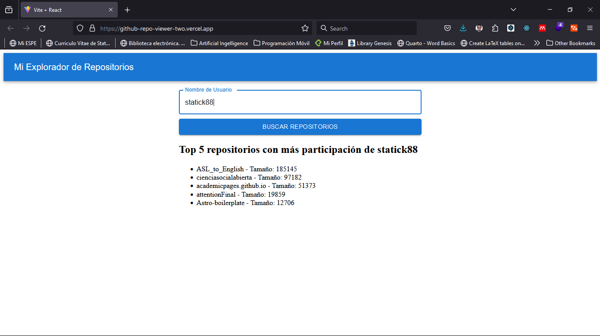

# Mi Explorador de Repositorios

Este es un proyecto de exploración de repositorios de GitHub desarrollado con React y Material-UI. Permite a los usuarios buscar repositorios por nombre de usuario y muestra los repositorios más populares junto con los principales lenguajes de programación utilizados.

## Demo

Puedes ver una demo del proyecto en el siguiente enlace: 

[Mi Explorador de Repositorios](https://github-repo-viewer-two.vercel.app/)

## Características

- **Búsqueda de Repositorios:** Los usuarios pueden ingresar el nombre de usuario de GitHub para buscar repositorios asociados.
- **Visualización de Repositorios:** Muestra los repositorios más populares del usuario junto con los principales lenguajes de programación utilizados en esos repositorios.
- **Integración de Material-UI:** Utiliza componentes de Material-UI para una interfaz de usuario moderna y atractiva.

## Ideas de Mejora

  1. **Autenticación de Usuario:** Implementar la autenticación de usuario utilizando OAuth de GitHub. Esto permitirá a los usuarios acceder a sus repositorios privados y obtener una experiencia más personalizada.

  2. **Paginación de Resultados:** Agregar paginación a la lista de repositorios para manejar grandes volúmenes de datos de manera más eficiente y mejorar la experiencia del usuario al navegar por múltiples páginas de resultados.

  3. **Filtrado de Repositorios:** Permitir a los usuarios filtrar los repositorios por diferentes criterios, como el número de estrellas, la fecha de creación o el idioma predominante.

  4. **Mejoras en la Interfaz de Usuario:** Realizar mejoras adicionales en la interfaz de usuario, como agregar animaciones suaves, mejorar la accesibilidad y optimizar el diseño para dispositivos móviles.

  5. **Implementación de Pruebas Automatizadas:** Desarrollar pruebas automatizadas utilizando herramientas como Jest y React Testing Library para garantizar la estabilidad y la calidad del código a medida que el proyecto crece y se desarrolla.

## Contribución

¡Las contribuciones son bienvenidas! Si tienes alguna idea de mejora, sugerencia o encuentras algún error, no dudes en abrir un issue o enviar un pull request.

# Licencia

Este proyecto está bajo la Licencia MIT.